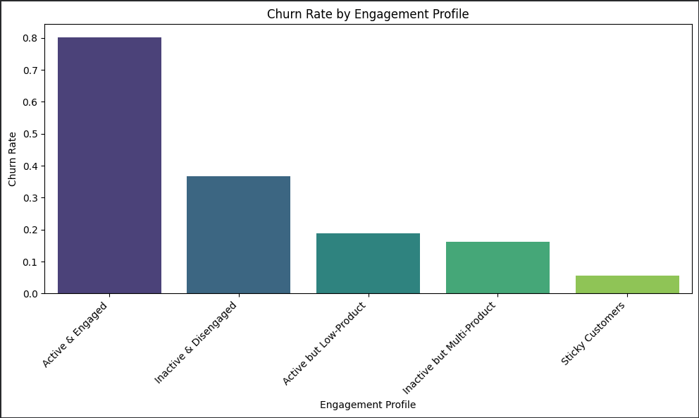
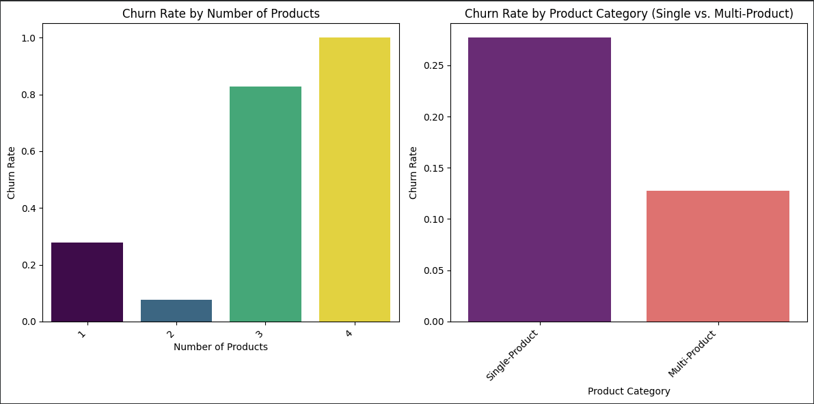
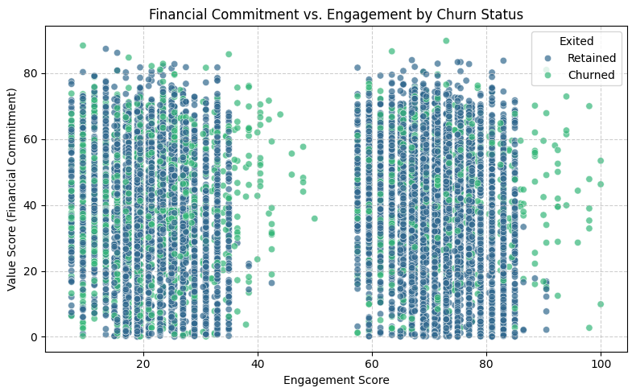

# Customer Engagement & Product Utilization Analytics for Retention Strategy
## Project Overview

Banks increasingly recognize that customer behavior and engagement, rather than demographics alone, drive long-term retention. Customers with high balances or salaries may still churn due to low engagement, weak product adoption, or shallow relationship depth.

This project reframes customer churn from a behavioral and relationship-strength perspective, focusing on how engagement and product utilization influence retention outcomes.

# Objectives
## Primary Objectives

Evaluate the relationship between customer engagement and churn

Measure the retention impact of product count and product mix

Identify high-value but disengaged customers

# Secondary Objectives

Support engagement-driven retention strategies

Improve product bundling decisions

Reduce silent churn among premium customers

#  Dataset Description

- **CustomerId**: Unique customer identifier  
- **CreditScore**: Customer creditworthiness  
- **Geography**: France, Spain, Germany  
- **Age**: Customer age  
- **Tenure**: Years with the bank  
- **Balance**: Account balance  
- **NumOfProducts**: Number of products  
- **HasCrCard**: Credit card ownership  
- **IsActiveMember**: Engagement indicator  
- **EstimatedSalary**: Annual salary  
- **Exited**: Churn indicator  

# Analytical Methodology
## Engagement Classification

Customers are segmented into:

Active & Engaged

Active but Low-Product

Inactive & Disengaged

Inactive High-Balance Customers

# Product Utilization Impact

Churn rate by number of products

Single vs multi-product retention comparison

Product depth vs churn trend

# Financial Commitment vs Engagement

Balance vs activity cross-analysis

Salary–balance mismatch detection

Identification of at-risk premium customers

# Retention Strength Scoring

A composite Relationship Strength Index is created using:

Engagement score

Product depth score

Financial commitment indicators

# Key Performance Indicators (KPIs) 

| KPI Name                         | Description                  |
|----------------------------------|------------------------------|
| Engagement Retention Ratio       | Active vs inactive churn     |
| Product Depth Index              | Products vs loyalty          |
| High-Balance Disengagement Rate  | Premium churn risk           |
| Credit Card Stickiness Score     | Retention impact             |
| Relationship Strength Index      | Composite loyalty score      |

# Streamlit Dashboard

## Core Modules

Engagement vs churn overview

Product utilization impact analysis

High-value disengaged customer detector

Retention strength scoring panels

# Deployment

The Streamlit application was deployed using ngrok, enabling secure public access to a locally hosted Streamlit server.

[Customer Engagement & Retention Strategy Dashboard]([url](https://ehtel-enormous-morphemically.ngrok-free.dev/))

Public live dashboard

Reproducible analytics

Portfolio-ready deployment

# Conclusion

This project demonstrates that engagement and product utilization are stronger predictors of retention than financial metrics alone. By identifying disengaged yet high-value customers, banks can design targeted, behavior-driven retention strategies to improve loyalty and reduce churn.

## Author
Dikshit

Customer Analytics | Data Analysis | Streamlit Applications

