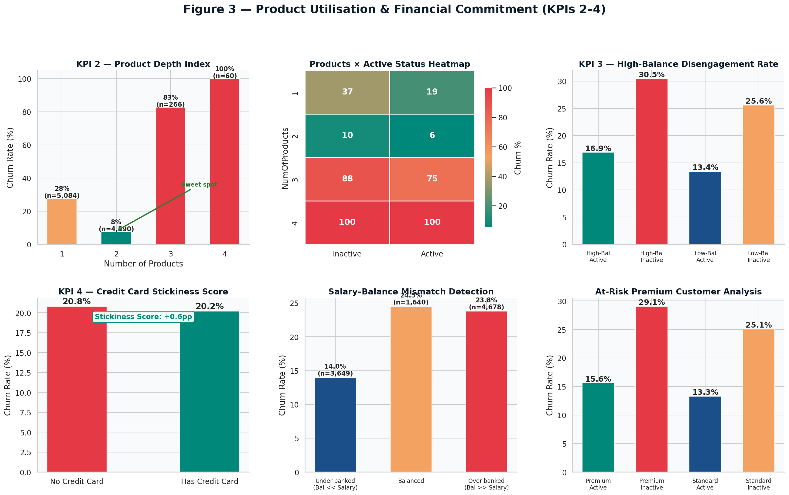

# 📊 Customer Engagement & Product Utilization Analytics  
### European Bank Churn & Retention Strategy

## 🚀 Project Overview
This project analyzes customer behavior in a European banking dataset to identify churn patterns, engagement levels, and opportunities for improving customer retention.

The goal is to move beyond basic churn detection and provide **actionable business insights** by combining:
- Customer engagement analysis  
- Product utilization patterns  
- Financial behavior  
- Predictive modeling  

---

## 🎯 Business Objective
Banks often struggle to retain customers despite having large datasets. This project answers:

- Which customers are most likely to churn?
- What drives engagement and loyalty?
- How can the bank improve retention using data-driven strategies?

---

## 🧠 Key Concepts Applied
- Feature Engineering  
- Exploratory Data Analysis (EDA)  
- KPI Development  
- Customer Segmentation  
- Predictive Modeling  
- Risk Profiling  

---

## 📂 Dataset
The dataset includes customer-level information such as:
- Demographics (age, geography, gender)
- Account details (balance, tenure, products)
- Activity status
- Churn indicator

---

## ⚙️ Project Workflow

### 1. Data Loading & Validation
- Cleaned and validated dataset
- Handled missing values and inconsistencies

### 2. Feature Engineering
- Created new variables to better capture customer behavior
- Derived engagement and financial indicators

### 3. KPI Computation
Developed key banking KPIs such as:
- Customer Engagement Score  
- Product Utilization Rate  
- Financial Strength Indicators  
- Retention Probability Metrics  

👉 These KPIs form the foundation for business decisions.

---

### 4. Exploratory Data Analysis (EDA)
- Identified patterns in churn vs non-churn customers
- Compared behavior across demographics and regions
- Highlighted hidden trends in engagement

---

### 5. Engagement Profile Analysis
- Segmented customers based on activity levels
- Distinguished between active vs passive users

---

### 6. Product Utilization Analysis
- Analyzed how product usage impacts retention
- Identified under-utilized customer segments

---

### 7. Retention Strength Assessment
- Built a framework to measure customer loyalty
- Classified customers into retention categories

---

### 8. Predictive Modeling
- Developed models to predict churn probability
- Identified key drivers influencing churn

---

### 9. Risk Segmentation & Premium Customers
- Segmented customers into:
  - High-risk churn group  
  - Medium-risk group  
  - Loyal/premium customers  

👉 This helps in targeted marketing and retention strategies.

---

## 📊 Key Insights
- Customers with **low engagement and fewer products** are more likely to churn  
- **Inactive members** show significantly higher churn probability  
- High balance alone does not guarantee retention — engagement matters more  
- A small segment of **premium customers contributes disproportionately to value**

---

## 💡 Business Recommendations
- Improve engagement through personalized offers  
- Target low-product users with cross-selling strategies  
- Focus retention campaigns on high-risk segments  
- Prioritize premium customers with loyalty programs  

---

## 📸 Visual Insights

Examples:
- Churn distribution charts  
- Engagement vs churn graphs  
- Product usage analysis  
- Model performance plots  

---

## 🛠️ Tech Stack
- Python  
- Pandas, NumPy  
- Matplotlib / Seaborn  
- Scikit-learn  
- Jupyter Notebook  

---

---

## 👤 Author
**Dikshit**  
Aspiring Data Analyst | Focused on Business Insights & Decision-Making  

🏢 Organization: Unified Mentor 

🔗 LinkedIn: [Dikshit](https://www.linkedin.com/in/dikshit-05a9a9244/)

---

## 🔍 Final Thought
This project demonstrates how raw customer data can be transformed into **strategic insights** that directly impact retention and revenue.
